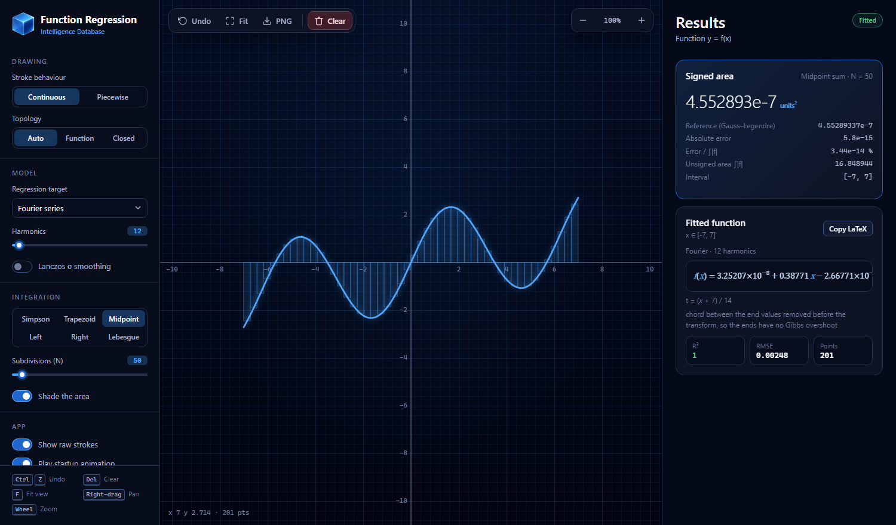

# Function Regression Algorithm

**Try it live: [enterlessguy.github.io/MATH-Function-Regression-Algorithm](https://enterlessguy.github.io/MATH-Function-Regression-Algorithm/)**

Draw a curve and get its formula. Function Regression fits what you draw with
a polynomial, Fourier series, exponential, logarithm or constant, turns closed
shapes into a parametric Fourier curve, and integrates the result with six
methods. You can paste any fitted formula straight into Desmos.

Part of the Intelligence Database family, alongside
[I-DB Macro](https://github.com/Enterlessguy/IDB-Macro) and the Schedule I
Control Center. It uses the same design system and startup animation.



## Run it

- **Online:** use the live link above. GitHub Pages republishes it on every
  push to `main`.
- **Offline:** download or clone the repository and double-click
  `index.html`. It's a static page with no build step, no server and no
  dependencies, and it runs straight from disk in current Chrome, Edge and
  Firefox.

Version 3 was called *Topographic Core* up to v2. See the
[changelog](CHANGELOG.md) for what changed.

## Using it

- **Draw** with the left mouse button, a pen or a finger. Continuous mode fits
  one stroke. Piecewise mode fits every stroke as its own segment.
- **Topology.** In continuous mode a stroke that ends near where it started is
  treated as a closed shape. You can also force it with *Function* or
  *Closed*.
- **Pan** with a right-drag or middle-drag. **Zoom** with the wheel, which
  zooms around the cursor.
- **Keys:** <kbd>Ctrl</kbd>+<kbd>Z</kbd> undo, <kbd>Del</kbd> clear,
  <kbd>F</kbd> fit the view to your strokes, <kbd>+</kbd>/<kbd>-</kbd> zoom,
  <kbd>0</kbd> reset the view.
- **Copy LaTeX** gives `y=… \left\{a\le x\le b\right\}`, which Desmos accepts
  as-is. Closed shapes copy as a parametric `(X(t), Y(t))` for `t` in [0, 1].

## The maths

| Piece | Method |
| --- | --- |
| Least squares | Householder QR on the weighted design matrix. Normal equations are not used, because they square the condition number. |
| Sample weights | Each point is weighted by the x-spacing around it, so the fit minimises the continuous L² error. Otherwise places where the pen moved slowly would count for more. |
| Polynomial | Chebyshev basis on x mapped to [−1, 1], evaluated with Clenshaw's recurrence. This stays accurate up to degree 30. The degree is capped by the number of distinct x values. |
| Exponential | Start from a log-linear fit (weighted by y² to undo the log's bias), then refine the true residuals with Levenberg–Marquardt. It handles negative amplitudes and is stored centred to avoid overflow. |
| Logarithmic | Exact linear least squares in ln x. Points with x ≤ 0 are ignored and counted. |
| Fourier (1-D) | The chord between the end values is removed first, so the periodic extension is continuous. There is no Gibbs overshoot at the ends, and the coefficients decay like 1/k². Computed with an FFT. |
| Closed shapes | The stroke is resampled uniformly by arc length, then transformed with a complex FFT. The area is π Σ k·\|cₖ\|², checked against the shoelace area of the raw stroke. |
| Lanczos σ | Optional. It uses σₖ = sinc(k/(m+1)), which never zeroes the last harmonic. It's off by default because both series above are already continuous, and σ shrinks shapes slightly. |
| Integration | Simpson, trapezoid, midpoint, left, right and Lebesgue sums. Every result is compared with a composite 5-point Gauss–Legendre reference, split at segment ends. Gaps between segments count as zero. |
| Lebesgue | ∫f⁺ = ∫₀^max μ{f > t} dt, using midpoint levels and a measure taken from sorted dense samples. The same is done for f⁻. |

Fit quality is shown as R² and RMSE for each segment.

## Tests

```bash
npm test        (or: node --test)
```

This needs Node 18 or later and has no packages to install. The tests cover
the solver, every model, conditioning at degree 30, the FFT, closed-curve
area, all integration methods and the formula formatter.

## Project layout

```
index.html          page shell and Content-Security-Policy
src/math.js         numerical core (pure functions, also loaded by the tests)
src/app.js          canvas, input, results panel
src/splash.js       Intelligence Database startup animation
.github/workflows/  CI (tests) and the GitHub Pages deploy
src/styles.css      design tokens and components
assets/             cube logo, greeting font, select chevron
tests/              node:test unit tests
```

## Security and privacy

The page makes no network requests and loads nothing from a CDN. A strict
Content-Security-Policy enforces this. Settings are stored in your browser's
`localStorage` and are validated when read. See [SECURITY.md](SECURITY.md).

## Licence

MIT. See [LICENSE](LICENSE) and [THIRD_PARTY_NOTICES.md](THIRD_PARTY_NOTICES.md).

## Disclaimer

This project has no affiliation with Intel Corporation.
